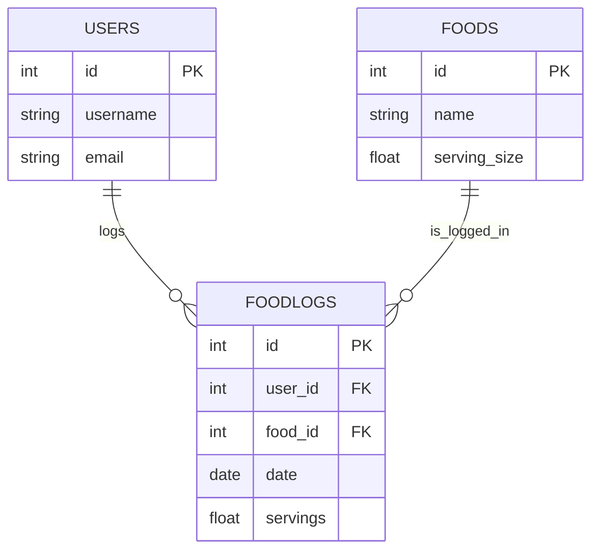

```mermaid
erDiagram
    USERS {
        int id PK
        string username
        string email
    }
    FOODS {
        int id PK
        string name
        float serving_size
    }
    FOODLOGS {
        int id PK
        int user_id FK
        int food_id FK
        date date
        float servings
    }
    USERS ||--o{ FOODLOGS : logs
    FOODS ||--o{ FOODLOGS : is_logged_in
```